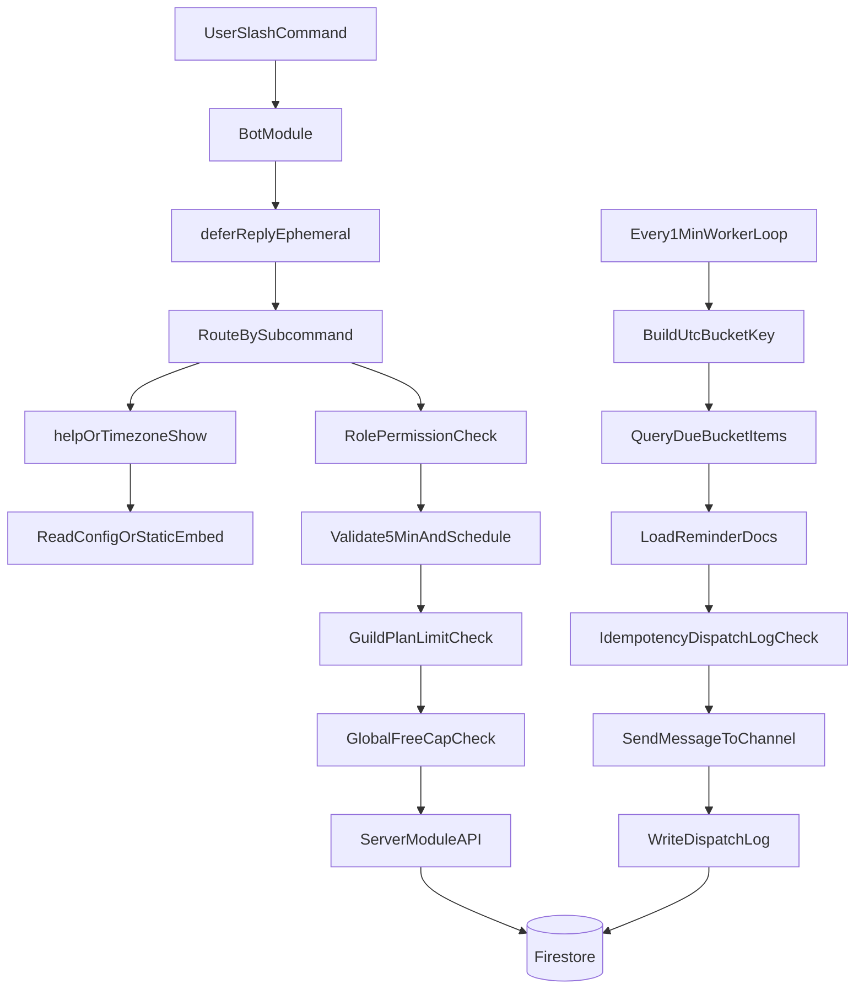

# Discord Reminder Bot Architecture (Spark-only)

## System Modules

- `apps/bot`: Discord slash command input/output.
- `apps/server`: API, Firestore transactions, due-bucket scheduler, cleanup job.
- `packages/shared`: Shared schemas, types, and UTC bucket utility logic.

## Data Flow

## Bucket Standard

- Worker only evaluates UTC time.
- API converts guild timezone schedule into UTC bucket keys at write time.
- Example: guild timezone `Asia/Taipei`, reminder `18:00` -> bucket `daily_1000_utc`.
- `timezone` value affects write-time conversion and display only; runtime dispatch still matches UTC buckets.

## Spark-only Constraints

- No Cloud Functions and no Cloud Scheduler.
- Long-running worker runs on GCP e2-micro.
- Firestore serves as storage plus due bucket index source.

## Command Surface (Current)

- Management: `/reminder create|update|delete`
- Read-only: `/reminder list|help|timezone show`
- Config write: `/reminder timezone set`
- Delete-all behavior: use `/reminder delete` multi-select and choose all items.

## Quota Check for 400 Reminders

Assumption aligned with `docs/traffic-estimation.md`:

- 100 guilds, 4 reminders each (`400` total)
- 50% daily + 50% weekday, average triggers per reminder/day = `0.857`
- dispatches/day = `400 * 0.857 = 343`

Estimated daily Firestore operations in current implementation:

- Reads:
  - due-bucket item reads ~= `343`
  - idempotency log read in transaction ~= `343`
  - reminder doc read before send ~= `343`
  - cleanup query reads (steady state) ~= `343`
  - total ~= `1,372` (`<< 50,000/day`)
- Writes:
  - dispatch log create + status update = `2` writes/dispatch
  - total ~= `686` (`<< 20,000/day`)
- Deletes:
  - cleanup deletes ~= `343` (`<< 20,000/day`)

Conclusion: with 400 reminders, current logic is safely within Spark quota with wide headroom.

## Global Free Cap Strategy

- Global cap document: `system_limits/global`.
- Free reminders can be created only if:
  - `freeCreateLocked == false`
  - `freeReminderGlobalCount < freeReminderGlobalCap`
- Hysteresis unlock:
  - lock at `>= 10000`
  - unlock at `<= 9800`
